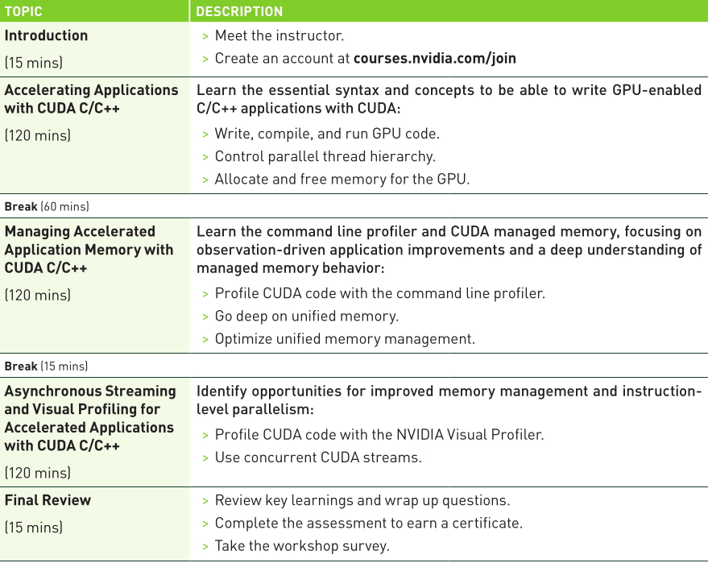
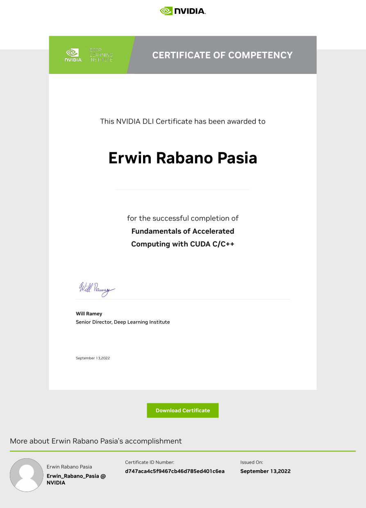

# [NVIDIA DLI - Advanced Technical Workshop: Fundamentals of Accelerated Computing with CUDA C/C++](https://learn.nvidia.com/courses/course-detail?course_id=course-v1:DLI+C-AC-01+V1) - COMPLETED!

# Fundamentals of Accelerated Computing with CUDA C/C++

This repository provides an overview of the **Fundamentals of Accelerated Computing with CUDA C/C++** course, offered by NVIDIA's Deep Learning Institute (DLI). The course is designed to teach developers how to accelerate and optimize existing C/C++ applications using CUDA, enabling them to harness the immense computational power of GPUs.

## Learning Objectives:
- Understand the fundamentals of GPU architecture and how it differs from CPU-based computing.
- Write and execute parallel code using CUDA C/C++ to accelerate computational tasks.
- Optimize memory transfers between CPU and GPU for maximum performance.
- Implement custom CUDA kernels for fine-grained control over parallel execution.
- Utilize advanced techniques like shared memory and streams to optimize performance.

## Overview of CUDA C/C++:
CUDA (Compute Unified Device Architecture) is a parallel computing platform and programming model developed by NVIDIA. It allows developers to use NVIDIA GPUs for general-purpose processing (GPGPU), enabling massive parallelism that can significantly accelerate computational tasks.

## Key Components of the Course:

### 1. Introduction to GPU Architecture:
The course begins by introducing NVIDIA GPU architecture and how it enables parallel computing. Participants will learn:
- How GPUs are structured for massive parallelism.
- Key differences between CPU and GPU execution models.

### 2. Writing CUDA Kernels in C/C++:
Participants will learn how to write custom CUDA kernels in C/C++ that offload computations to the GPU. Topics covered include:
- Understanding the CUDA thread hierarchy (grids, blocks, threads).
- Launching kernels on the GPU for massively parallel execution.
- Avoiding race conditions with atomic operations.

### 3. Memory Management in CUDA:
Efficient memory management is crucial for maximizing performance in GPU applications. This section covers:
- Techniques for optimizing memory bandwidth using memory coalescing.
- Managing data transfers between host (CPU) and device (GPU).
- Using on-device shared memory to minimize data transfer overhead.

### 4. Performance Optimization Techniques:
The course provides strategies for tuning performance, including:
- Profiling GPU applications using tools like `nvprof` and Nsight Systems.
- Optimizing kernel execution by adjusting thread block sizes and grid dimensions.
- Utilizing streams for concurrent kernel execution and overlapping computation with data transfers.

### 5. Advanced CUDA Features:
Participants will explore advanced features of CUDA such as:
- **Streams**: For asynchronous execution, allowing concurrent kernel execution and memory transfers.
- **Unified Memory**: Simplifies memory management by automatically migrating data between CPU and GPU.

## Key Tools and Libraries:

### CUDA Toolkit:
Participants will work with the CUDA Toolkit, which provides essential tools such as:
- The CUDA runtime API for managing GPU resources.
- Profiling tools like `nvprof` and Nsight Systems for performance analysis.

### Nsight Systems:
A performance analysis tool used to identify bottlenecks in GPU applications, helping developers optimize their code further.

## End-to-End Workflow Acceleration:
By the end of the course, participants will be able to build fully functional, end-to-end workflows that leverage GPU acceleration at every stage—from data processing to algorithm execution. This includes:
- Accelerating linear algebra operations originally designed for CPUs.
- Implementing complex simulations or scientific computations using GPUs.

## Best Practices for Refactoring CPU Workflows:
The course emphasizes best practices for refactoring existing CPU-based workflows into GPU-based ones:
- Identify computational bottlenecks where GPUs can provide significant speedups.
- Use CUDA libraries like cuBLAS or cuFFT where applicable to accelerate common tasks without writing custom kernels from scratch.

## Comparison Between CPU vs. GPU Workflows:

| Aspect                   | CPU Workflow (Traditional)                      | GPU Workflow (CUDA C/C++)                                 |
|--------------------------|-------------------------------------------------|-----------------------------------------------------------|
| Data Processing Time      | Slower due to sequential execution              | Faster due to parallel processing on GPUs                  |
| Algorithm Execution Time  | Longer due to limited CPU cores                 | Shorter due to massive parallelism on GPUs                 |
| Scalability               | Limited by CPU resources                        | Scalable across multiple GPUs                              |
| API Familiarity           | Standard C/C++                                  | Similar APIs via CUDA extensions                           |

## Conclusion:
By completing this course, participants will gain hands-on experience in building high-performance applications using NVIDIA's CUDA C/C++ framework. They will be equipped with the skills necessary to:

- Refactor existing CPU-based applications into faster, GPU-based ones.
- Write new custom kernels for advanced parallel processing tasks.
- Optimize memory management and kernel execution for maximum performance.

This course is ideal for developers who have experience with C/C++ programming but want to explore how GPU acceleration can significantly improve the performance of their applications.

## Instructor-Led Workshop Outline:

    

## [Certificate Of Competency:](https://learn.nvidia.com/certificates?id=d747aca4c5f9467cb46d785ed401c6ea)

    

